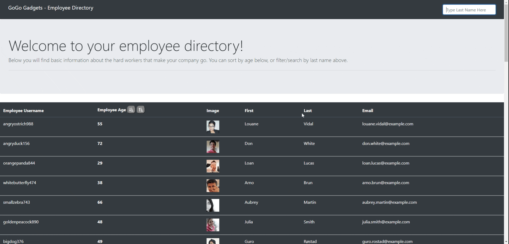

# Reactive Employee Directory

## Description of Project
This app is a dynamic employee management system created with React.js.  

Users are able to sort employees by age and filter by last name, which are both useful for human resources management.  

Read below for further details.  Enjoy!

## Table of Contents

- [Usage](#usage)
- [Credits and Code Used](#credits-and-code-used)
- [Application Demo](#application-demo)
- [Questions](#questions)
- [Takeaways and Future Development](#takeaways-and-future-development)

## Usage
Check out the GH-pages deployed application [here!](https://smcmillan28.github.io/REACTive-employee-directory/)

## Credits and Code Used

- JavaScript/ES6
- Node.js
- React
- Bootstrap
- Font Awesome
- npm packages (react, react-dom, font-awesome, bootstrap, axios)

## Application Demo

## Questions
Check out my GitHub profile [here.](https://github.com/smcmillan28)

Feel free to send me an email, as well: smcmillan1991@gmail.com

## Takeaways and Future Development
It's easy to see the importance of learning how to build single-page React applications.  Steps and stages for future development include:

- Incorporating "add employee" functionality (will require setup of database and database maintenance)
- Adding a page for login/logout and incorporating conditional rendering
- Enhanced styling